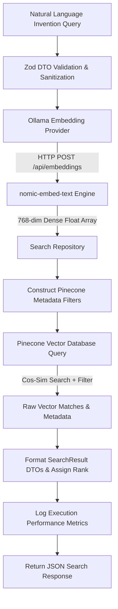

# PatentIQ - Semantic Patent Search Pipeline Documentation

## 🔍 Overview

The **Semantic Patent Search Pipeline** forms the core retrieval engine of PatentIQ. It transforms natural language invention ideas into 768-dimensional dense vector embeddings and queries a indexed Pinecone vector database populated with millions of patent sections. 

The pipeline supports native backend **metadata filtering** and returns Top-K ranked search results complete with similarity scores, patent identifiers, document sections, IPC classifications, and fine-grained latency metrics.

---

## 🔄 End-to-End Search Workflow



---

## 🛠️ Step-by-Step Pipeline Mechanics

### 1. Query Sanitization & DTO Validation (`SearchRequestDtoSchema`)
Requests submitted to `POST /api/search` are validated by Zod:
- `query`: Trimmed non-empty string representing the user's invention idea.
- `topK`: Integer between `1` and `100` (defaults to `10`).
- `filters`: Optional search filter object supporting `ipc`, `country`, `publicationDateFrom`, `publicationDateTo`, `owner`, and `section`.

### 2. Embedding Generation (`OllamaEmbeddingProvider`)
The raw query text is sent to the local Ollama instance running the `nomic-embed-text` embedding model:
- **Dimensions**: `768` floats.
- **Normalization**: L2 normalized float array.
- **Performance**: Tracked via `queryEmbeddingTimeMs`.

```typescript
const { embedding, durationMs } = await this.embeddingProvider.generateEmbedding(query);
```

### 3. Pinecone Vector Search & Metadata Filtering (`SearchRepository`)
The generated 768-dimensional vector and metadata filter criteria are passed to Pinecone's vector index query API using cosine similarity distance:

```typescript
const pineconeFilter: Record<string, any> = {};

if (filters?.ipc) {
  pineconeFilter['ipc'] = { $eq: filters.ipc };
}
if (filters?.country) {
  pineconeFilter['country'] = { $eq: filters.country };
}
if (filters?.section) {
  pineconeFilter['section'] = { $eq: filters.section };
}
if (filters?.publicationDateFrom || filters?.publicationDateTo) {
  pineconeFilter['publicationDate'] = {};
  if (filters.publicationDateFrom) pineconeFilter['publicationDate']['$gte'] = filters.publicationDateFrom;
  if (filters.publicationDateTo) pineconeFilter['publicationDate']['$lte'] = filters.publicationDateTo;
}
```

### 4. Ranking & Result Formatting (`formatResults`)
Raw Pinecone vector match results are converted into structured `SearchResult` objects:
- **`rank`**: 1-based ordinal position sorted descending by similarity score.
- **`score`**: Cosine similarity score (e.g. `0.9124`).
- **`patentId`**: Unique patent identifier (e.g. `US1234567`).
- **`title`**, **`abstract`**, **`claims`**: Extract metadata fields stored directly in Pinecone records.
- **`ipc`**, **`country`**, **`owner`**, **`publicationDate`**: Categorical metadata attributes.

### 5. Performance Metrics Logging
Every search request logs detailed execution telemetry without exposing sensitive query text or document payloads:

```text
[SearchAPI] query="An autonomous drone charging station" | topK=10 | count=10 | highestScore=0.9124 | latency=184ms
```

---

## 📊 Latency Metrics Breakdown (`SearchMetrics`)

The response metadata contains high-resolution latency tracking:

```json
"metrics": {
    "queryEmbeddingTimeMs": 42,
    "pineconeSearchTimeMs": 142,
    "totalExecutionTimeMs": 184,
    "totalResults": 10
}
```

- **`queryEmbeddingTimeMs`**: Time spent calling Ollama `nomic-embed-text`.
- **`pineconeSearchTimeMs`**: Time spent executing index vector search in Pinecone.
- **`totalExecutionTimeMs`**: Total end-to-end request handling time.
