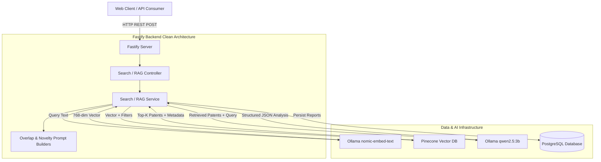

# PatentIQ - Automated Patent Prior-Art Search & RAG Intelligence Engine

> Production-ready AI-powered patent prior-art retrieval, novelty analysis, claim overlap identification, and performance evaluation platform built on Fastify, Pinecone, and Ollama.

---

## 📌 Executive Overview

**PatentIQ** is an enterprise-grade automated patent prior-art search engine. It enables inventors, patent examiners, and IP attorneys to analyze novel invention ideas against millions of vectorized prior-art patents in seconds. 

By combining **semantic vector retrieval** with **Retrieval-Augmented Generation (RAG)** using locally deployed large language models, PatentIQ delivers structured novelty reports, section-level overlap analysis, and specific claim matching while enforcing strict anti-hallucination guardrails.

---

## ✨ Key Features

- **Semantic Patent Search (`POST /api/search`)**: Real-time vector similarity search matching invention descriptions against Pinecone vector embeddings with similarity score ranking.
- **Native Metadata Filtering**: Granular filtering by International Patent Classification (IPC) codes, country, publication date ranges, document sections (`title`, `abstract`, `claims`), and patent assignees/owners.
- **Retrieval-Augmented Generation (`POST /api/rag/analyze`)**: Concurrent execution of 7-section structured novelty analysis and section/claim overlap identification using local Qwen (`qwen2.5:3b`) via Ollama.
- **Claim Overlap Analysis**: Pinpoints exact matching claims (e.g. Claim 3) and patent sections (Title, Abstract, Claims, Summary, Background, Detailed Description) with overlap strength classification (`High`, `Medium`, `Low`).
- **Retrieval Evaluation & Benchmarking (`POST /api/search/benchmark`)**: Automated multi-query benchmarking measuring P95/P99 latency, embedding vs search latency breakdown, throughput (req/s), and IR quality metrics (Precision@K, Recall@K, MRR, NDCG, Hit Rate).
- **Clean Architecture & Strict Type Safety**: Dependency-injected Node.js Fastify backend with Zod validation, SOLID design principles, and comprehensive custom error handling.

---

## 🛠️ Technology Stack

| Layer | Technology | Purpose |
| :--- | :--- | :--- |
| **Transport / Framework** | [Fastify](https://fastify.dev/) + [TypeScript](https://www.typescriptlang.org/) | High-performance asynchronous HTTP server with strict typing |
| **Vector Database** | [Pinecone](https://www.pinecone.io/) | Managed cloud vector database for 768-dimensional patent embeddings |
| **Local AI / LLM** | [Ollama](https://ollama.com/) | Local model runner hosting `nomic-embed-text` and `qwen2.5:3b` |
| **Relational Database** | [PostgreSQL](https://www.postgresql.org/) + [Prisma ORM](https://www.prisma.io/) | Structured relational storage for patents, reports, users, and audit logs |
| **Validation & DI** | [Zod](https://zod.dev/) + `fastify-plugin` | Strict runtime DTO schema validation and Dependency Injection container |
| **Frontend** | React + TypeScript | Interactive web UI dashboard |

---

## 📐 System Architecture Overview



---

## 📚 Technical Documentation Index

For in-depth architectural breakdown, pipeline internals, and deployment guides, explore the dedicated documentation guides:

1. 🏛️ **[System Architecture](architecture.md)** — Clean Architecture, DI container, request lifecycle, error handling.
2. 🔍 **[Semantic Search Pipeline](search-pipeline.md)** — Text chunking, vector generation, Pinecone query execution, and metadata filtering.
3. 🤖 **[RAG Pipeline & Intelligence](rag-pipeline.md)** — Structured novelty prompts, claim overlap classification, anti-hallucination guardrails.
4. 🔌 **[REST API Reference](api.md)** — Endpoint schemas, request/response DTOs, validation rules, and JSON payload examples.
5. 🚀 **[Deployment Guide](deployment.md)** — Step-by-step local setup, Docker configuration, database migrations, and troubleshooting.
6. ⚙️ **[Configuration Guide](configuration.md)** — Complete `.env` reference, Pinecone setup, and Ollama configuration.
7. 📊 **[Benchmarking & Evaluation](benchmarking.md)** — IR quality metrics (Precision, Recall, MRR, NDCG), latency percentiles (P95, P99), and benchmarking endpoint.
8. 📁 **[Project Structure](project-structure.md)** — Directory taxonomy, module descriptions, coding standards, and future roadmap.

---

## 🚀 Quickstart Guide

### Prerequisites
- **Node.js**: `v20.x` or higher
- **PostgreSQL**: `v15.x` or higher
- **Ollama**: Installed locally with models:
  ```bash
  ollama pull nomic-embed-text
  ollama pull qwen2.5:3b
  ```
- **Pinecone Account**: API Key and Index created (`dimension: 768`, `metric: cosine`).

### 1. Installation
```bash
git clone https://github.com/rithishcodespace/PatentIQ.git
cd PatentIQ
npm install
```

### 2. Configure Environment
Copy `.env.example` to `apps/server/.env` and update credentials:
```bash
cp apps/server/.env.example apps/server/.env
```

### 3. Database Migration
```bash
npx prisma migrate dev --schema=apps/server/prisma/schema.prisma
```

### 4. Run Development Server
```bash
cd apps/server
npm run dev
```
The server will start at `http://localhost:4000`.

---

## 📡 Core API Summary

| Endpoint | Method | Description |
| :--- | :--- | :--- |
| `/api/search` | `POST` | Execute semantic vector search over prior-art patents with optional metadata filters |
| `/api/search/benchmark` | `POST` | Run multi-query latency benchmark and compute IR quality metrics |
| `/api/rag/analyze` | `POST` | Perform 7-section RAG novelty analysis & section/claim overlap identification |
| `/api/rag/rank` | `POST` | Execute hybrid search reranking over candidate patents |
| `/health` | `GET` | Health check endpoint returning server status |

---

## 🔮 Future Roadmap

- [ ] **Hybrid Search Integration**: Combining BM25 sparse keyword matching with Pinecone dense vector retrieval.
- [ ] **Cross-Encoder Reranking**: Re-scoring top-50 candidate patents using a cross-encoder model before RAG ingestion.
- [ ] **Streaming Responses**: Server-Sent Events (SSE) for streaming Qwen novelty analysis responses in real-time.
- [ ] **Citation-Aware RAG**: Automated cross-linking between novelty report claims and specific prior-art patent numbers.
- [ ] **Ground Truth Evaluation Datasets**: Standardized benchmark dataset for tracking retrieval precision and recall over time.

---

## 📄 License

Distributed under the MIT License. See `LICENSE` for more information.
