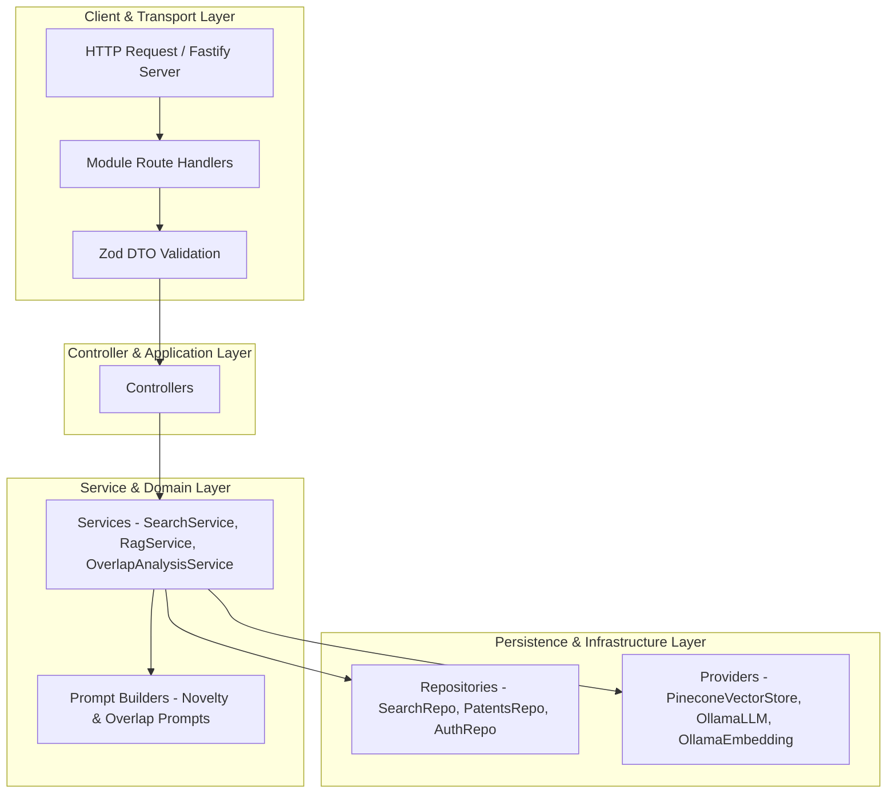
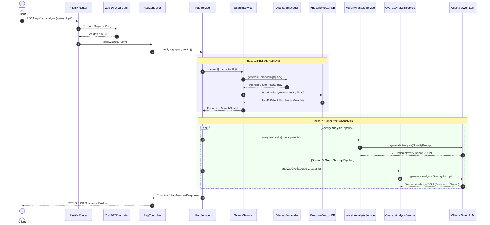

# PatentIQ - System Architecture & Design Documentation

## 🏛️ Architectural Overview

PatentIQ is built on the principles of **Clean Architecture** and **SOLID Design Patterns**. The backend system decouples HTTP transport interfaces from business logic, domain services, data persistence, and external AI providers. 

This modular isolation ensures that infrastructure components (such as vector store providers or local LLM runtimes) can be swapped, tested, or scaled independently without modifying core business rules.

---

## 🧱 Architectural Layers



### 1. Transport & Routing Layer (`src/modules/*/routes/`)
- Registers Fastify REST endpoints under standardized URL prefixes (`/api/search`, `/api/rag`, etc.).
- Enforces request body validation using Zod schemas before handing execution to controllers.
- Maps domain-specific errors to HTTP status codes (`400 Bad Request`, `401 Unauthorized`, `503 Service Unavailable`).

### 2. Controller Layer (`src/modules/*/controllers/`)
- Acts as the entry point for HTTP requests within each module.
- Decoupled from transport details by receiving pre-validated request payloads.
- Delegates business execution to domain services.
- Logs structured execution metrics (e.g. `[SearchAPI] query="..." | latency=...ms`).

### 3. Service Layer (`src/modules/*/services/`)
- Contains the core business logic, domain rules, and orchestration pipelines.
- Examples:
  - **`SearchService`**: Coordinates vector embedding generation via Ollama and vector similarity queries via Pinecone.
  - **`RagService`**: Orchestrates concurrent novelty analysis and claim overlap analysis using search results.
  - **`OverlapAnalysisService`**: Evaluates patent sections and claims against invention queries using structured LLM prompts.

### 4. Infrastructure Provider Layer (`src/providers/`)
- Abstracts external hardware/cloud APIs behind interface contracts (`IVectorStoreProvider`, `ILLMProvider`, `IEmbeddingProvider`).
- Implementations:
  - **`PineconeVectorStoreProvider`**: Manages Pinecone vector database index connection, query, and metadata upsert operations.
  - **`OllamaEmbeddingProvider`**: Handles local HTTP requests to Ollama's `nomic-embed-text` embedding model.
  - **`OllamaLLMProvider`**: Manages chat completion requests to Ollama's local `qwen2.5:3b` model.

### 5. Repository Layer (`src/modules/*/repositories/`)
- Abstracts database persistence (PostgreSQL via Prisma ORM) and vector query execution.
- Encapsulates SQL query logic, data mappings, and transaction management.

---

## 🔌 Dependency Injection Container (`src/plugins/di.plugin.ts`)

PatentIQ uses `fastify-plugin` to construct a central Dependency Injection (DI) container. Providers, repositories, services, and controllers are instantiated at application startup in dependency order and decorated onto the Fastify instance as `fastify.diContainer`.

```typescript
// Example DI Container Initialization Flow
const vectorStoreProvider = new PineconeVectorStoreProvider();
const llmProvider = new OllamaLLMProvider();
const embeddingProvider = new OllamaEmbeddingProvider();

const searchRepo = new SearchRepository();
const searchService = new SearchService(embeddingProvider, searchRepo);
const benchmarkService = new BenchmarkService(searchService);
const ragService = new RagService(searchService, llmProvider);

const searchController = new SearchController(searchService);
const ragController = new RagController(ragService);
```

---

## 🔄 Request Lifecycle Sequence

The following sequence diagram illustrates the lifecycle of a POST request to `/api/rag/analyze`:



---

## ⚠️ Error Handling & Resilience Strategy

PatentIQ implements a unified custom error handling hierarchy defined in `src/common/errors/http-errors.ts`:

- **`CustomError`**: Abstract base class extending native `Error` with HTTP status code and operational flag.
- **`BadRequestError` (400)**: Thrown on Zod validation failures or malformed payload formats.
- **`UnauthorizedError` (401)**: Thrown on invalid or missing JWT tokens.
- **`NotFoundError` (404)**: Thrown when requested patents or reports do not exist.
- **`ServiceUnavailableError` (503)**: Thrown when external dependencies (Ollama runtime, Pinecone network connectivity, or PostgreSQL DB) fail or time out.

### Global Error Handler (`src/common/middleware/error-handler.middleware.ts`)
The Fastify error handler catches unhandled exceptions, logs the detailed error stack for debugging, and returns a standardized JSON error structure to clients:

```json
{
  "success": false,
  "error": "ServiceUnavailableError",
  "message": "Ollama service is unavailable: fetch failed",
  "statusCode": 503
}
```
