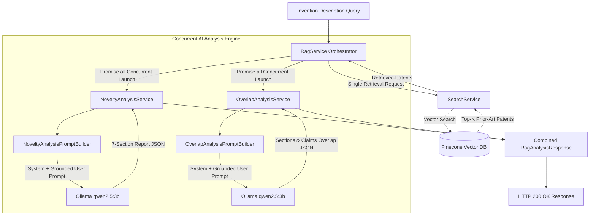

# PatentIQ - Retrieval-Augmented Generation (RAG) Pipeline

## 🤖 RAG Architecture Overview

The **Retrieval-Augmented Generation (RAG) Pipeline** (`POST /api/rag/analyze`) enhances search retrieval with local generative AI intelligence. Instead of relying solely on general LLM knowledge, PatentIQ feeds retrieved prior-art patents into local Qwen (`qwen2.5:3b`) via Ollama.

The pipeline performs **single-pass retrieval** and concurrently executes two specialized analysis engines:
1. **`NoveltyAnalysisService`**: Generates a 7-section structured novelty and patentability report.
2. **`OverlapAnalysisService`**: Identifies specific overlapping patent claims (e.g. Claim 3) and patent sections with strength classification (`High`, `Medium`, `Low`).

---

## ⚡ Concurrent Dual-Engine Architecture



---

## 🛡️ Anti-Hallucination Guardrails & Grounding Rules

Patent analysis requires absolute factual accuracy. PatentIQ enforces strict system prompt guardrails in `NoveltyAnalysisPromptBuilder` and `OverlapAnalysisPromptBuilder` to eliminate LLM hallucinations:

1. **Strict Grounding**: The LLM is explicitly instructed to reason **only** from the provided user invention query and retrieved prior-art patent metadata.
2. **No Invented Identifiers**: The model is forbidden from inventing or fabricating patent numbers, claim numbers, IPC codes, or non-existent document sections.
3. **Explicit Data Fallbacks**: If claim text is absent from the retrieved metadata, the prompt enforces returning:
   ```text
   "The retrieved context does not contain sufficient claim information."
   ```
4. **Non-Legal Qualified Tone**: Outputs use objective examiner language (*"The retrieved patent suggests..."*, *"Based on available claims..."*).

---

## 🔬 Analysis Modules Breakdown

### 1. Novelty Analysis Engine (`NoveltyAnalysisService`)
Produces a 7-section structured JSON analysis:
- **`summary`**: Executive synthesis of patentability and prior-art landscape.
- **`similarPatents`**: Breakdown of retrieved prior-art patents and their similarity metrics.
- **`featureComparison`**: Tri-partitioned comparison (`commonFeatures`, `uniqueFeatures`, `partialOverlap`).
- **`novelAspects`**: Specific inventive aspects present in the user's idea but absent from prior art.
- **`overlappingClaims`**: Direct feature overlap notes.
- **`risks`**: Prior-art infringement or novelty rejection risks under patent law.
- **`recommendations`**: Actionable advice for refining claims or drafting patent specifications.

### 2. Section & Claim Overlap Analysis Engine (`OverlapAnalysisService`)
Produces a fine-grained overlap mapping array:
- **`patentId`**: Target patent number (e.g. `US1234567`).
- **`title`**: Patent title.
- **`similarityScore`**: Cosine similarity score.
- **`relevantSections`**: Array of contributing document sections (`Title`, `Abstract`, `Claims`, `Background`, `Summary`, `Description`) with explanatory reasoning.
- **`overlappingClaims`**: Array of matching claims detailing:
  - `claimNumber`: Exact claim number (e.g. `3`).
  - `summary`: Gist of the claim text.
  - `reason`: Specific technical rationale for the overlap.
  - `overlapStrength`: Categorized as `"High"`, `"Medium"`, or `"Low"`.

---

## ⏱️ Pipeline Performance Instrumentation

The RAG pipeline records latency breakdown for each processing phase:

```typescript
export interface RagMetrics {
  retrievedCount: number;
  retrievalTimeMs: number;
  promptTimeMs: number;
  llmInferenceTimeMs: number;
  overlappingClaimsCount: number;
  totalTimeMs: number;
}
```

```text
[RagAPI] query="..." | retrievedCount=10 | overlappingClaims=3 | retrievalMs=180ms | promptMs=5ms | llmMs=1240ms | totalMs=1425ms
```
